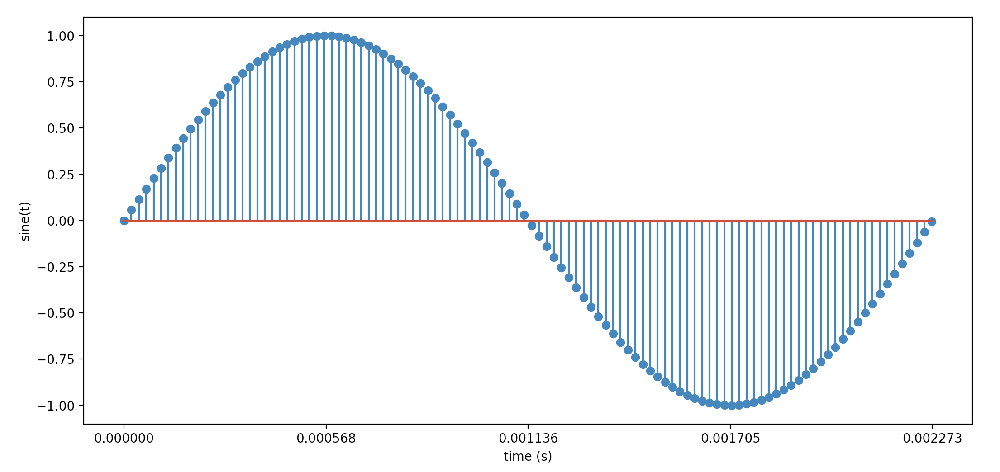

# Part 1 - Making a Sound

For this first part, the goal is simple - generate a sine wave tone
in C++ that can be heard on PC speakers.

Sounds easy enough, so let's dive in!

## CMake, basic C++ project

Since we're starting with a blank slate, we need to get
a basic C++ executable to build, something like "Hello, World".

I'll be using CMake to build the project.

Here's the CMakeLists.txt:

```cmake
cmake_minimum_required(VERSION 3.0)
project(lets_make_a_synth)

set(CMAKE_CXX_STANDARD 17)
set(CMAKE_CXX_STANDARD_REQUIRED ON)
set(CMAKE_CXX_EXTENSIONS ON)

string(JOIN " " CXX_FLAGS_LIST
    -O2
    -Wall
    -Werror
)
set(CMAKE_CXX_FLAGS "${CXX_FLAGS_LIST}")
add_executable(synth main.cpp)
```

And here's main.cpp:

```cpp
#include <stdio.h>

int main(int argc, char* argv[]) {
    printf("__cplusplus: %ld\n", __cplusplus);
    return 0;
}
```

This simply prints the C++ version to `stdout` and returns.

I've also created a top-level `build.sh` script for convenience,
that simply invokes cmake and make:

```sh
mkdir -p build
cd build
cmake ..
make
```

And now, we can build it:

```
$ ./build.sh
-- Configuring done
-- Generating done
-- Build files have been written to: /users/nick.miller/src/lets_make_a_synth/build
Consolidate compiler generated dependencies of target synth
[ 50%] Building CXX object CMakeFiles/synth.dir/src/main.cpp.o
[100%] Linking CXX executable synth
[100%] Built target synth
```

And we can run it:

```
$ build/synth
__cplusplus: 201703
```

Great! Now we've got a basic C++ project compiling and running.

## Research - How Do I Send Audio to My Sound Device?

So, how exactly do sound devices work? How do we send audio data to the
card?

For this, I turned to the Internet. Searching "Real time generate sound C"
turned up some good hits. After following some links and reading a few
StackOverflow links, I learned a few things:

* There's no easy, cross-platform way to send raw audio data to the sound
    card. We'll need an audio library.
* There are a bajillion audio libraries to choose from.

At this point, I think it makes sense to take a step back and think about the goals
of this project:

* Learn about digital synthesizers.
* Learn about real-time audio in C++.
* Spend majority of coding time on the synthesizer. Don't
  spend a lot of time implementing things from scratch not related to the
  synthesizer.
* We want to hear a sine wave from our speakers as fast and easily as
    possible.

Given these general goals, we can turn our focus to selecting an audio
library. Here are the rough criteria I came up with:

* Needs to be free, open-source, cross-platform, and support real-time audio
* Can't be too low level, as to be difficult to use.
* Can't be too high level, as to take away the joy
    of learning about real-time audio, digital signal processing,
    and digital synthesizers.

Out of the hundreds of possible audio libraries out there, there were three
that jumped out as front-runners in my quick search:

* Option 1: SDL2
    - Pro: I've used SDL2 before
    - Pro: there is [example audio code online](https://github.com/lundstroem/synth-samples-sdl2/blob/master/src/synth_samples_sdl2_1.c)
    - Pro: Can easily pair with an SDL2 graphical UI, if/when we need that in the future
    - Con: Not sure how reliable it is for real-time audio
- Option 2: PortAudio
    - Pro: Used by many popular projects, like Audacity and VLC
    - Pro: Good tutorial docs: http://files.portaudio.com/docs/v19-doxydocs/writing_a_callback.html
    - Con: More of a learning curve for me personally, compared to SDL2
- Option 3: openal
    - Con: too low level

At this early stage of the project, I chose SDL2 for the audio library.
It's possible this may change to PortAudio in the future if SDL audio is
not up to the task, but I hope that doesn't happen.

## Creating an SDL Window

We already have a basic C++ project, but now we need to add SDL2 into the mix.
For now, we just want to get a basic SDL window to show.

First, we must install SDL2.

MacOS:

```sh
brew install sdl2
```

Ubuntu:

```sh
sudo apt-get install libsdl2-dev
```

Here's the new CMakeLists.txt, that includes SDL2:

```cmake
cmake_minimum_required(VERSION 3.0)
project(lets_make_a_synth)

set(CMAKE_CXX_STANDARD 17)
set(CMAKE_CXX_STANDARD_REQUIRED ON)
set(CMAKE_CXX_EXTENSIONS ON)

# https://github.com/Kitware/CMake/blob/master/Modules/FindSDL.cmake
list(APPEND CMAKE_MODULE_PATH ${CMAKE_CURRENT_SOURCE_DIR}/../cmake)
find_package(SDL2 REQUIRED)
include_directories(${SDL2_INCLUDE_DIR})

string(JOIN " " CXX_FLAGS_LIST
    -O2
    -Wall
    -Werror
)
set(CMAKE_CXX_FLAGS "${CXX_FLAGS_LIST}")
add_executable(synth main.cpp)
target_link_libraries(synth PRIVATE ${SDL2_LIBRARY})
```

And, finally, we've got to modify `main.cpp` to initialize SDL and create a
window with a dark gray background.

Here are the important parts (omitting cleanup and error-handling code
for readability):

```cpp
#include <SDL.h>

static SDL_Renderer* _renderer;
static SDL_Window* _window;

int main(int argc, char* argv[]) {
    SDL_Init(SDL_INIT_AUDIO | SDL_INIT_VIDEO);
    _window = SDL_CreateWindow(
        "Synth",
        SDL_WINDOWPOS_UNDEFINED, SDL_WINDOWPOS_UNDEFINED,
        WINDOW_WIDTH, WINDOW_HEIGHT,
        0
    );
    _renderer = SDL_CreateRenderer(
            _window,
            -1,
            SDL_RENDERER_ACCELERATED | SDL_RENDERER_PRESENTVSYNC);
    SDL_RenderSetLogicalSize(_renderer, WINDOW_WIDTH, WINDOW_HEIGHT);

    bool loopShouldStop = false;
    SDL_Event event = {};

    while (!loopShouldStop) {
        while (SDL_PollEvent(&event)) {
            if (event.type == SDL_QUIT) {
                loopShouldStop = true;
            }
        }
        SDL_RenderClear(_renderer);
        SDL_SetRenderDrawColor(_renderer, 25, 25, 25, 255);
        SDL_RenderPresent(_renderer);
    }

    close();
    return 0;
}
```

This code initializes the SDL library, creates a window, creates a renderer
which we can draw a background color to, then enters a loop that will run
until the user closes the window, or force quits the program (e.g. Ctrl-C).

This is not meant to be a series about SDL, so if you want to learn more
about the SDL library, the [Lazy Foo' SDL
Tutorials](https://lazyfoo.net/tutorials/SDL/) are recommended.

## Initializing SDL Audio

Now that we have a window and a main loop, we can initialize the audio
sub-system of SDL.

### Opening the Audio Device

Audio device parameters are specified through the `SDL_AudioSpec` struct:

```cpp
SDL_AudioSpec desired = {};
desired.freq = 48000;          // 48 KHz sampling frequency
desired.format = AUDIO_F32SYS; // 32-bit float samples
desired.channels = 2;          // stereo
desired.samples = 64;          // Audio buffer size, in samples
desired.callback = audioCallback; // Callback to populate audio samples
```

With that spec, we can open a default audio device:

```cpp
SDL_AudioSpec actual = {};
_audioDevice = SDL_OpenAudioDevice(NULL, 0, &desired, &actual, 0);
```

The parameters we set are the "desired" parameters, but the actual audio parameters
might be different, depending on what the system is capable of. Once the
device is open, you can check whether the `actual` spec matches the `desired`
spec, to verify, for instance, that the sampling frequency was actually set
to 48 KHz (and not some other frequency, like 44.1 KHz).

### A Primer on Audio Callbacks

The way SDL audio works is - there is a separate high-priority audio thread that runs
in SDL, and when it needs new audio data to send to hardware, it will call
our `audioCallback` function with a buffer that needs to be filled by us with
sample data. The size of this buffer will depend on our sample buffer size,
which we've set to 64, meaning there are 64 samples per buffer.
Each sample consist of two 32-bit float values (one for left channel, one for
right), so the total buffer size in bytes is 64 * 2 * sizeof(float) = 512 bytes.

With 64 samples per buffer and a sample rate of 48 KHz, this means the buffer
will hold a total of (64 / 48000) = .001333 seconds = 1.333 ms of audio data.
That also means our callback will be called roughly every 1.333 ms. That's
pretty darn fast. That means
our callback can't waste any time - it needs to fill the buffer as fast as it
can and return as soon as possible. No time for `printf` inside of that
callback! In fact, blocking of any kind is a big no-no (e.g. locking a mutex).

The samples per buffer also determines the audio latency.
Most musicians playing a live instrument need 10 ms or less of latency, or else they'll start to notice.
We have an audio
latency of about 1.333 ms. Or in other words, from the time the sound is
triggered, it will take about 1.333 ms to reach the speakers. In reality, it might
actually be twice this amount, but it should be good enough for our purposes.

I think (though I'm not certain) that SDL uses a front and back buffer,
such that it will call our callback to fill the back buffer while the hardware is accessing the front
buffer. Then when the front buffer runs out, it swaps front and back, then
calls our callback to fill the back buffer again.

Okay, cool, so let's write this audio callback.

### The Audio Callback

The most basic audio callback would be something like this, that simply
sets all audio data to 0.

```cpp
static void audioCallback(void* userdata, Uint8* stream, int len) {
    memset(stream, 0, (size_t)len);
}
```

Since we're dealing with 32-bit float samples, the range of each sample
will be -1.0 to 1.0. We set
all samples to zero, which will result in _bone-chilling_ silence, which
pairs well with our dark window background.

## Generating a sine wave

Okay, now for the fun part.

* We're going to generate a sine wave with values between -1 and 1
* That data will get sent to the sound card
* The sound card will convert the digital data to analog signals
* The analog signals will be routed to the PC speakers
* The speakers will physically move in and out at a rate of 440 times per second in response
  to the analog signal, causing changes in air presssure, or "sound waves".

Our human ears are sensitive to these kinds of changes of air pressure, and will
be perceived by us as "sound". Cool!

In digital audio terms, this sine wave is called an "oscillator". There are
infintely many types of oscillators, and a sine wave is just one of them.

As a reminder, this is the equation for a sine wave, as a function of time:

```
y(t) = A * sin(2 * PI * f * t + p)

where,
    A: amplitude,
    f: frequency, in hertz
    t: time, in seconds
    p: phase shift
```

We won't use the phase shift term `p`, so we can leave that at 0.
The values of `y(t)` will be in the range -1 to 1.

We can't perfectly represent this sine wave in digital form, so we will
sample points of the sine wave at regular intervals, according to the sampling rate.
With a sample rate of 48 KHz, we need to compute `y(t)` every 1/48000 = 2.083e-5 seconds.
By sampling that way, you end up with an "almost sine wave" that looks like
this:



This is a single period of our digitized 440 Hz sine wave (wave period is 1/440 = .002273 seconds).

Okay, so how can we do this in code?

The main idea is that in our audio callback we will step forward in time
by some small amount `dt` equal to `1/48000`, then compute the sine at that point in time, and
we will do this for however many samples we need to populate the audio buffer.

In code, that will look something like this:

```cpp
// Max volume, scaling factor from 0.0 to 1.0
#define VOLUME 0.025 // about -32 dB

static void audioCallback(void* userdata, Uint8* stream, int len) {
    constexpr double twoPi = 2.0 * M_PI;
    constexpr double dt = 1.0 / 48000;
    constexpr double freqHz = 440;
    constexpr double periodS = 1.0 / freqHz;

    static double t = 0.0;
    while (len > 0) {
        // Compute the sample point
        double y = VOLUME * sin(twoPi * freqHz * t);

        // Populate left and right channels with the same sample
        float* left = (float*)(stream);
        float* right = (float*)(stream + 4);
        *left = (float)y;
        *right = (float)y;

        t += dt;
        if (t >= periodS) { // wraparound
            t -= periodS;
        }

        // Advance forward in the stream
        stream += (2 * sizeof(float));
        len -= (2 * sizeof(float));
    }
}
```

Note that the value `t` is marked `static`, meaning that the value will
persist across calls. This means the next time our audio callback is called,
t will continue where it left off, which is important so that our sine wave
is smooth and continuous, and not restarting every time the callback is called.

We don't want our ears to start bleeding, so the `VOLUME` scaling factor
reduces the sine wave amplitude to a comfortable listening level.

After compiling and running the program again, we get a glorious tone
at 440 Hz. We won't be winning Grammy's anytime soon, but it feels good
to have basic audio working.

## Triggering Sound with the Mouse

It's not ideal that the sine wave plays immediately when the program starts.
It would be nice to have some control over when the wave starts and stops.

We're going to start playing the sound wave when a mouse button is clicked,
and we will continue playing the sound while the button is held down.

To do this, we need to listen to mouse click events in the SDL loop:

```c
    while (!loopShouldStop) {
        // Check for events
        while (SDL_PollEvent(&event)) {
            if (event.type == SDL_QUIT) {
                loopShouldStop = true;
            } else if (event.type == SDL_MOUSEBUTTONDOWN) {
                _playSound = true;
            } else if (event.type == SDL_MOUSEBUTTONUP) {
                _playSound = false;
            }
        }
```

Then we need to use `_playSound` in our audio callback:

```c
static void audioCallback(void* userdata, Uint8* stream, int len) {
    // ...
    while (len > 0) {
        double y = 0.0; // default sample value
        if (_playSound) {
            y = VOLUME * sin(twoPi * freqHz * t);
        }
        //...
    }
    // ...
}
```

Running the program, you will see that the 440 Hz sine wave is only audible
when the mouse button is held down. It sounds a little like morse code
if you click really fast!

### That Annoying Click at the Beginning and End

If you try the program out, you'll discover there's an audible and annoying
clicking sound when the wave starts to play, and again when the wave stops
playing. What could be causing this?

The problem is that our value `t` is always incrementing by `dt`, regardless of
whether the sine wave is playing or not. That means that when we finally
trigger the sound, `t` will be at some random location in the middle
of the sine wave, which causes a rapid change in `y` from 0 to `y(t)`, for whatever
value of `t` we happened to land on. Likewise the audible click when the sound stops is due to a rapid change from
`y(t)` to 0, for whatever value of `t` we happened to be on.

We will fix this clicking problem by
treating the mousedown event as a "start request" and mouseup event as a
"stop request", but the actual starting and stopping will be controlled
by the audio callback. In the callback, we will wait until the beginning
of the waveform period to fulfull the start/stop request, because this is
the point in the waveform where the value is close to 0. This will prevent
rapid changes in value that were the source of the audible click.

```cpp
static bool _start;
static bool _stop;
static bool _soundEnabled;

static void audioCallback(void* userdata, Uint8* stream, int len) {
    // ...
    while (len > 0) {
        double y = 0.0;
        if (_soundEnabled) {
            y = VOLUME * sin(twoPi * freqHz * t);
        }
        // ...
        t += dt;
        if (t >= periodS) { // wraparound
            // We're at the start of the wave, so it's
            // safe to enable or disable sound here.
            assert(y <= 0.001);
            if (_start) {
                _start = false; // clear flag
                _soundEnabled = true;
            } else if (_stop) {
                 _stop = false; // clear flag
                _soundEnabled = false;
            }
            t -= periodS;
        }
        //...
    }
    // ...
}

int main(int argc, char* argv[]) {
    // ...
    // SDL Main Loop
    while (!loopShouldStop) {
        // Check for events
        while (SDL_PollEvent(&event)) {
            if (event.type == SDL_QUIT) {
                loopShouldStop = true;
            } else if (event.type == SDL_MOUSEBUTTONDOWN) {
                _start = true; // cleared by audioCallback
            } else if (event.type == SDL_MOUSEBUTTONUP) {
                _stop = true; // cleared by audioCallback
            }
        }
    // ...
```

There, that sounds much better.

## Wrapping Up

That's all for this part. We covered a lot of ground!

1. We created a window in SDL
1. We opened an audio device
1. We generated a sine wave and got it to play through our speakers
1. We added the ability to start/stop playback by clicking the mouse
1. We fixed the annoying clicking sound at the beginning and end of playback

In the next part, we'll introduce other kinds of oscillators, like the
square wave, triangle wave, and saw wave.

If you want to demo the final program for this part in your web browser,
click on the link below.

<https://ncmiller.dev/wasm/synth_part1/>
