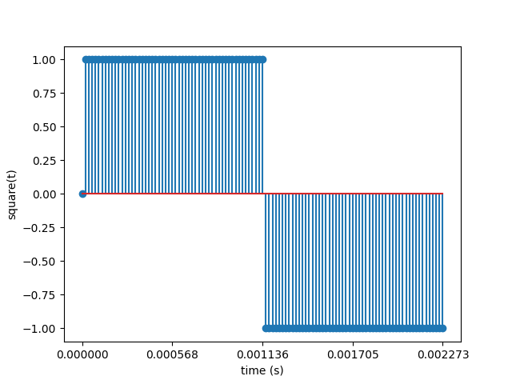

# Part 2 - Oscillators

In part 1, we got a basic sine wave at 440 Hz to play
out of the PC speakers. The sine wave is a type of
oscillator.

In part 2, we will explore other common synthesizer oscillators,
like the square wave, saw wave, and triangle wave, and a noise
generator.

## Square Wave Oscillator

You probably already know what a square wave looks like, and you probably
already have a good idea of how to program one in software.

What you may not know (unless you remember your advanced math classes) is that the
square wave has an interesting harmonic series consisting of a strong
fundamental frequency, and gradually weaker odd harmonics.


By contrast, sine waves do not have any harmonics. You just get the boring old
fundamental frequency. You can add multiple sine waves together to get a square wave.
As a result, the square wave has a more interesting and complex sound than
the smooth and clean sine wave. The square wave is often characterized as having a "rich" and
"buzzy" sound.

Since we're going to have two different kinds of ocillators now, let's create a function
for each one.

First, we'll refactor the code to put the sine computation in it's own
function.

```cpp
typedef double (*OscillatorFn)(double t, double freqHz);

static double sine(double t, double freqHz) {
    constexpr double twoPi = 2.0 * M_PI;
    return sin(twoPi * freqHz * t);
}

static void audioCallback(void* userdata, Uint8* stream, int len) {
    // ...
    OscillatorFn oscFn = sine;

    while (len > 0) {
        double y = 0.0;
        if (_soundEnabled) {
            y = VOLUME * oscFn(t, freqHz);
        }
    // ...
}
```

This will allow us to easily swap out the oscillator by reassigning
a different `OscillatorFn`.

Now, let's create the square wave function, and use that in the audio
callback.

```cpp
static double square(double t, double freqHz) {
    const double halfPeriodS = 1.0 / freqHz / 2.0;
    if (t < halfPeriodS) {
        return 1;
    } else {
        return -1;
    }
}

static void audioCallback(void* userdata, Uint8* stream, int len) {
    // ...
    OscillatorFn oscFn = square;
    // ...
}
```

The frequency here is still 440 Hz. The period of the wave is
1 / 440 = 2.27272 ms. The square wave is `+1` for the first
half of the period, and `-1` for the second half, then the wave
repeats.



It has a much sharper sound than the sine.

## Saw Wave Oscillator

The saw wave is a ramp that starts at -1 and increases to 1 linearly, then
sharply drops down to -1 to repeat the period. It has even more harmonics
than the square wave. Whereas the square had only odd harmonics, the saw
has all harmonics (every integer multiple of the fundamental frequency).

The sound is harsh and clear.


Here's the code. It's not very complicated.

```cpp
static double saw(double t, double freqHz) {
    const double periodS = 1.0 / freqHz;
    const double percentComplete = t / periodS;
    // scale and offset to get it in range [-1, 1]
    return 2.0 * percentComplete - 1.0;
}

static void audioCallback(void* userdata, Uint8* stream, int len) {
    // ...
    OscillatorFn oscFn = saw;
    // ...
}
```

## White Noise Oscillator

## Switching Between Sounds

It would be nice if we could switch between sine, square, and other types
of oscillators without having to recompile the code every time.

Let's try this - whenever the right mouse button is click, we will cycle
to the next oscillator.
