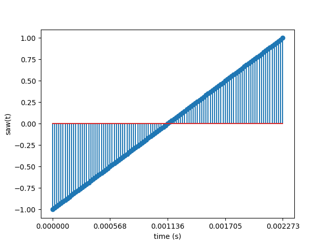

# Part 2 - Oscillators

In part 1, we got a basic sine wave at 440 Hz to play
out of the PC speakers. The sine wave is a type of
oscillator.

In part 2, we will explore other common synthesizer oscillators,
like the square wave, saw wave, and triangle wave, and a noise
generator.

## Square Wave Oscillator

You probably already know what a square wave looks like, and you probably
already have a good idea of how to program one in software.

What you may not know (unless you remember your advanced math classes) is that the
square wave has an interesting harmonic series consisting of a strong
fundamental frequency, and gradually weaker odd harmonics.


By contrast, sine waves do not have any harmonics. You just get the boring old
fundamental frequency. You can add multiple sine waves together to get a square wave.
As a result, the square wave has a more interesting and complex sound than
the smooth and clean sine wave. The square wave is often characterized as having a "rich" and
"buzzy" sound.

Since we're going to have two different kinds of ocillators now, let's create a function
for each one.

First, we'll refactor the code to put the sine computation in it's own
function.

```cpp
typedef double (*OscillatorFn)(double t, double freqHz);

static double sine(double t, double freqHz) {
    constexpr double twoPi = 2.0 * M_PI;
    return sin(twoPi * freqHz * t);
}

static void audioCallback(void* userdata, Uint8* stream, int len) {
    // ...
    OscillatorFn oscFn = sine;

    while (len > 0) {
        double y = 0.0;
        if (_soundEnabled) {
            y = VOLUME * oscFn(t, freqHz);
        }
    // ...
}
```

This will allow us to easily swap out the oscillator by reassigning
a different `OscillatorFn`.

Now, let's create the square wave function, and use that in the audio
callback.

```cpp
static double square(double t, double freqHz) {
    const double halfPeriodS = 1.0 / freqHz / 2.0;
    if (t < halfPeriodS) {
        return 1;
    } else {
        return -1;
    }
}

static void audioCallback(void* userdata, Uint8* stream, int len) {
    // ...
    OscillatorFn oscFn = square;
    // ...
}
```

The frequency here is still 440 Hz. The period of the wave is
1 / 440 = 2.27272 ms. The square wave is `+1` for the first
half of the period, and `-1` for the second half, then the wave
repeats.


It has a much sharper sound than the sine.

## Saw Wave Oscillator

The saw wave is a ramp that starts at -1 and increases to 1 linearly, then
sharply drops down to -1 to repeat the period. It has even more harmonics
than the square wave. Whereas the square had only odd harmonics, the saw
has all harmonics (every integer multiple of the fundamental frequency).

The sound is harsh and clear.



Here's the code. It's not very complicated.

```cpp
static double saw(double t, double freqHz) {
    const double periodS = 1.0 / freqHz;
    const double percentComplete = t / periodS;
    // scale and offset to get it in range [-1, 1]
    return 2.0 * percentComplete - 1.0;
}

static void audioCallback(void* userdata, Uint8* stream, int len) {
    // ...
    OscillatorFn oscFn = saw;
    // ...
}
```

## Triangle Oscillator

The triangle wave looks like a triangle. Yep.


It sounds a little like the square wave, but softer, kind of like a mix of the
square and sine wave.

```cpp
static double triangle(double t, double freqHz) {
    t = fmod(t, 1.0 / freqHz);
    const double periodS = 1.0 / freqHz;
    const double percentComplete = t / periodS;
    if (percentComplete <= 0.5) {
        // 1 down to -1
        return 1.0 - 4.0 * percentComplete;
    } else {
        // -1 up to 1
        return -1.0 + 4.0 * (percentComplete - 0.5);
    }
}

static void audioCallback(void* userdata, Uint8* stream, int len) {
    // ...
    OscillatorFn oscFn = triangle;
    // ...
}
```

## White Noise Oscillator

To generate white noise, we just need to generate random points from -1 to 1,
uniformly distributed across all frequencies. For our purposes, `rand()` is
good enough.

```cpp
static double whitenoise(double t, double freqHz) {
    double rand_normalized = (double)rand() / (double)RAND_MAX;
    return 2.0 * rand_normalized - 1.0;
}

static void audioCallback(void* userdata, Uint8* stream, int len) {
    // ...
    OscillatorFn oscFn = whitenoise;
    // ...
}
```

It sounds like static on a TV. It doesn't seem like this one would be terribly
useful, but it has a lot of applications, provided you can modulate and tame it in
the right way (which we will do in later parts). It can be used for
percussive sounds (e.g. snare drum), general background ambience and texture,
and can be used for "buildups" in EDM.

It's worth noting that this noise is not periodic, and doesn't depend at all
on the parameters `t` and `freqHz`. It doesn't seem like it should really be
called an oscillator, but I think most people still call it that.

## Switching Between Sounds

It would be nice if we could switch between sine, square, and other types
of oscillators without having to recompile the code every time.

We don't have any kind of UI yet, so let's just hack something in that let's
us cycle through the oscillators one by one whenever we right click. It's
unlikely this code will stick around for long, so we just want something quick
and dirty.

```cpp
static OscillatorFn _oscFn = sine;

static void nextOsc() {
    if (_oscFn == sine) {
        _oscFn = square;
    } else if (_oscFn == square) {
        _oscFn = triangle;
    } else if (_oscFn == triangle) {
        _oscFn = saw;
    } else if (_oscFn == saw) {
        _oscFn = whitenoise;
    } else if (_oscFn == whitenoise) {
        _oscFn = sine;
    }
}

// ...

static void loop(void* arg) {
    // Check for events
    SDL_Event event;
    while (SDL_PollEvent(&event)) {
        if (event.type == SDL_QUIT) {
            _loopShouldStop = true;
        } else if (event.type == SDL_MOUSEBUTTONDOWN) {
            if (event.button.button == SDL_BUTTON_LEFT) {
                _start = true;
            }
        } else if (event.type == SDL_MOUSEBUTTONUP) {
            if (event.button.button == SDL_BUTTON_LEFT) {
                _stop = true;
            } else if (event.button.button == SDL_BUTTON_RIGHT) {
                nextOsc();
            }
        }
    }
    // ...
}
```

Also, that 440 Hz tone is getting a little old. Let's listen to the A that
is one octave down at 220 Hz. I think it's a little easier to distinguish the
character of each oscillator at this frequency.

```cpp
static void audioCallback(void* userdata, Uint8* stream, int len) {
    // ...
    constexpr double freqHz = 220.0;
    // ...
}
```

## Drawing the Waveform

It would be nice to visualize the waveform we are hearing.
Let's draw the currently selected oscillator waveform to the SDL renderer.

```cpp
static void drawCircle(int centerX, int centerY, int radius) {
    for (int y = -radius; y <= radius; y++) {
        for (int x = -radius; x <= radius; x++) {
            if (x * x + y * y <= radius * radius) {
                SDL_RenderDrawPoint(_renderer, centerX + x, centerY + y);
            }
        }
    }
}

static void drawWaveform(void) {
    SDL_SetRenderDrawColor(_renderer, 50, 205, 50, 255); // lime green

    int padding = (int)(0.1 * (double)WINDOW_WIDTH);
    int drawingWidth = WINDOW_WIDTH - 2 * padding;

    // Draw the waveform from left to right, as if starting
    // from the waveform point at t = 0.
    const double periodS = 1.0 / 220.0;
    for (double t = 0.0; t < periodS; t += _dt) {
        double y = _oscFn(t, _freqHz);
        // Convert (t,y) to 2-D coord (px,py)
        int px = padding + (int)((t / periodS) * drawingWidth);
        int py = padding + (int)((drawingWidth / 2) * (1.0 - y));
        int radius = (_soundEnabled ? 4 : 1);
        drawCircle(px, py, radius);
    }
}

// ...

static void loop(void* arg) {
    // ...
    // Render frame with dark gray background
    SDL_SetRenderDrawColor(_renderer, 25, 25, 25, 255);
    SDL_RenderClear(_renderer);
    drawWaveform();
    SDL_RenderPresent(_renderer);
}
```

The `drawWaveform` function sweeps `t` from `0` to `periodS` and uses the
oscillator functions to compute the corresponding `y` at that time `t`.

The renderer requires us to draw things in pixel space, so we have to convert
(t,y) to the corresponding pixel (px,py) in 2D pixel space.
Converting `t` to `px` is straightforward, and involves scaling
the `t` value by the `drawingWidth` and adding a bit of padding so it doesn't
brush up against the edge of the window. The `py`
coordinate is a little tricker, because we have to translate the 0 point to the middle
of the window and invert the y axis (window y == 0 is top, y == WINDOW_HEIGHT
is bottom).

## Pitch Bend with Mouse Movement

Listening to one note is kind of boring, so let's modulate the frequency when the mouse moves.
Movement up will increase frequency, and down will decrease frequency.

This is mostly just for fun, so hacky code is fine here.

In our SDL loop, we'll need to listen for mouse motion events and change the
frequency based on the relative change in mouse Y coord since the last motion
event.

```cpp
        // ...
        } else if (event.type == SDL_MOUSEMOTION) {
            constexpr double dFreqMaxHz = 220.0;
            if (_soundEnabled) {
                _freqHz -= dFreqMaxHz * ((double)event.motion.yrel / (double)WINDOW_HEIGHT);
                // Clip if freq goes too low or high
                _freqHz = std::max(_freqHz, 1.0);
                _freqHz = std::min(_freqHz, SAMPLE_RATE_HZ / 2.0);
            }
        }
        // ...
```

This is called pitch bend, and we limit the bending to a max of 220 Hz in
either direction for a single click. If you click and drag multiple times
you can bend beyond 220 Hz.

You'll notice that the sound tears a bit when you move the mouse
rapidly. This is happening because it causes a discontinuity in the sampled
points returned from the oscillator functions. If you have a nice smooth
sine wave, then you jump suddenly 100 Hz up, the next computed sample point
is going to be very disjoint from the prior sample, causing the audible
distortion. There are ways to fix this using techniques like interpolation
which we will explore in later parts.

### The Aliasing Problem

If you select the square or saw wave and increase the frequency a lot (you might
have to click and drag up several times), you'll
notice some strange dissonant overtones.

This is a problem called "frequency aliasing",
and is a direct consequence of the
[Nyquist-Shannon Sampline Theorem](https://en.wikipedia.org/wiki/Nyquist%E2%80%93Shannon_sampling_theorem)
which basically states that it's impossible to represent any frequencies above
half of our sampling rate. Or flipped around - we can represent any frequency
up to half of our sampling rate (48000 / 2 = 24000 Hz), but anything above
that will "wrap around" to other frequencies that are not natural harmonics of
the fundamental, causing a dissonant sound.

Our square and saw waves, when
represented as a Fourier series, have an infinite number of harmonics, which
go well above our Nyquist cutoff of 24000 Hz. The waves would sound cleaner
and undistorted if we could somehow remove all harmonics above 24000 Hz. We
will address this problem of aliasing in future parts.

## Wrapping up

In this part we:

1. Explored different kinds of oscillators, including the saw, square, triangle,
   and white noise oscillators.
1. Added a feature to change the oscillator with a right mouse click
1. Added a visualization of the waveform
1. Added a feature to pitch bend the oscillator using mouse vertical motion
1. We identified a problem with "frequency aliasing", especially noticeable in
   the square and saw waves at high frequencies.

In the next part, we'll introduce some knobs and sliders so that we can have
interactive control over parameters such as the amplitude and pitch.

If you want to demo the final program for this part in your web browser,
click on the link below.

<https://ncmiller.dev/wasm/synth_part2/>
