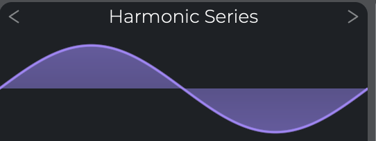

# Part 3 - Oscillators

In part 2, we implemented different types of oscillators,
and we even had a primitive UI that allowed cycling through
the oscillators and pitch-bending the frequency using mouse
click-and-drag.

In part 3, we will introduce a better UI framework that will allow us
to create knobs, buttons, selectors, sliders, and more.

It may seem early to start on the UI, but having a decent UI framework
early on will pay dividends later, and it will make our synth more interactive
and fun to play with.

However, if you're just not interested in UI at all, feel free to skip this part.

## Planning

Before diving in and writing UI code, we need to plan what we want our
synth to look like.

For this part, we'll keep the UI simple and see where it takes us.
We'll need to build a UI that has the following:

* The ability to write text to an arbitrary location in the window
* The ability to draw primitive shapes, such as rectangles, lines, and cicles
* A knob, for adjusting the volume level of the oscillator
* Another knob, for adjusting the left/right pan
* A value click-and-drag to control coarse-grained pitch (by semitones)
* A value click-and-drag to control fine-grained pitch (less than one semitone)
* A piano roll at the bottom, highlighting current tones that are being played
* A waveform plot with a waveform selector on top. Something like the
  selector in Vital synth

I did a fair bit of research on immediate mode GUIs vs retained mode GUIs.
Casey Muratori has an excellent, although biased, [video](https://www.youtube.com/watch?v=Z1qyvQsjK5Y&ab_channel=CaseyMuratori)
explaining the difference between the two.

After some back and forth, I decided to use an immediate mode GUI
(or IMGUI, for short), for a couple of reasons:

* IMGUI is good for fast development and easier to get started.
* It's a fun experiment in IMGUI. At least, more fun than using Qt (or any other retained mode GUI).

At this point, you might (rightly) be asking questions like:

* Why are you designing your own UI library?
* Why not just use Dear ImGui?
* Why not just use the JUCE framework, which includes UI elements?

To this, I would say: because it seems interesting to me to design a UI from
scratch, without relying on third-party libraries. Also, we can easily build
exactly what we need, and it will be custom-tailored for this synth. We're
not building a general-purpose UI library, we're creating a UI specifically
for this synth project.

I'm completely new to designing UI frameworks, so this could be a complete
disaster. Let's go!

## Integrate SDL_ttf and Lato font

We'll need a library to be able to render text to the window.
SDL includes a ttf library, but we need to do some extra work in CMake to use
it. I'll spare you the boring details of integrating the library.
If you're really interested, check out the changes
to CMakeLists.txt and the new file `cmake/FindSDL2_ttf.cmake`.

For the actual font, we will pull in [Lato](https://fonts.google.com/specimen/Lato)
to the `assets/fonts/` directory.

## Refactor - Moving the UI code out of main.cpp

Currently, all of our code is in `main.cpp`. However, things are getting a bit
messy there, so in preparation for our UI work, let's create some new files.

We'll start by creating a file `synth.h` that will contain a struct with
all of the globally available data. All of the global variables we were using
in `main.cpp` will go into this struct.

## UI class

## Text

## Drawing

## Plot

## Knob

## Horizontal Selector

## Value Dragger

## Volume level

## Stereo panning

## Pitch transposition

## Piano roll and keyboard input
