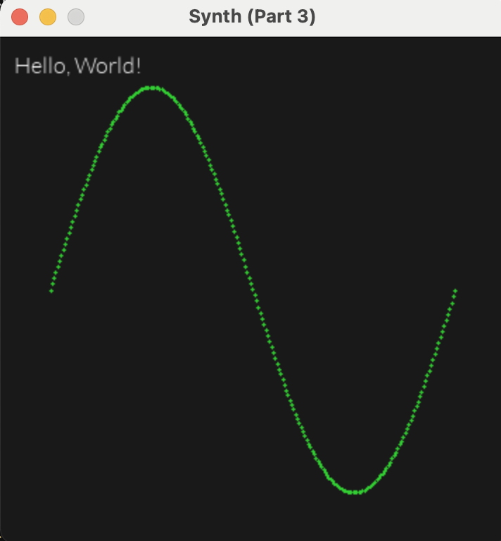

# Part 3 - Oscillators

In part 2, we implemented different types of oscillators,
and we even had a primitive UI that allowed cycling through
the oscillators and pitch-bending the frequency using mouse
click-and-drag.

In part 3, we will introduce a better UI framework that will allow us
to create knobs, buttons, selectors, sliders, and more.

It may seem early to start on the UI, but having a decent UI framework
early on will pay dividends later, and it will make our synth more interactive
and fun to play with.

However, if you're just not interested in UI at all, feel free to skip this part.

## Planning

Before diving in and writing UI code, we need to plan what we want our
synth to look like.

For this part, we'll keep the UI simple and see where it takes us.
We'll need to build a UI that has the following:

* The ability to write text to an arbitrary location in the window
* The ability to draw primitive shapes, such as rectangles, lines, and cicles
* A knob, for adjusting the volume level of the oscillator
* Another knob, for adjusting the left/right pan
* A value click-and-drag to control coarse-grained pitch (by semitones)
* A value click-and-drag to control fine-grained pitch (less than one semitone)
* A piano roll at the bottom, highlighting current tones that are being played
* A waveform plot with a waveform selector on top. Something like the
  selector in Vital synth


I did a fair bit of research on immediate mode GUIs vs retained mode GUIs.
Casey Muratori has an excellent, although biased, [video](https://www.youtube.com/watch?v=Z1qyvQsjK5Y&ab_channel=CaseyMuratori)
explaining the difference between the two.

After some back and forth, I decided to use an immediate mode GUI
(or IMGUI, for short), for a couple of reasons:

* IMGUI is good for fast development and easier to get started.
* It's a fun experiment in IMGUI. At least, more fun than using Qt (or any other retained mode GUI).

At this point, you might (rightly) be asking questions like:

* Why are you designing your own UI library?
* Why not just use Dear ImGui?
* Why not just use the JUCE framework, which includes UI elements?

To this, I would say: because it seems interesting to me to design a UI from
scratch, without relying on third-party libraries. Also, we can easily build
exactly what we need, and it will be custom-tailored for this synth. We're
not building a general-purpose UI library, we're creating a UI specifically
for this synth project.

I'm completely new to designing UI frameworks, so this could be a complete
disaster. Let's go!

## Integrate SDL_ttf and Lato font

We'll need a library to be able to render text to the window.
SDL includes a ttf library, but we need to do some extra work in CMake to use
it. I'll spare you the boring details of integrating the library.
If you're really interested, check out the changes
to CMakeLists.txt and the new file `cmake/FindSDL2_ttf.cmake`.

For the actual font, we will pull in [Lato](https://fonts.google.com/specimen/Lato)
to the `assets/fonts/` directory.

## Refactor - Moving code out of main.cpp

Currently, all of our code is in `main.cpp`. However, things are getting a bit
messy there, so in preparation for our UI work, let's create some new files.

We'll start by creating files `oscillator.h` and `oscillator.cpp` that will contain an
`Oscillator` class.

```cpp
class Oscillator {
public:
    void nextFn();
    double getSample(double t, double freqHz) const;

private:
    OscillatorFn _fn = sine;
};
```

Similarly, we'll create `ui.h` and `ui.cpp`, to contain a `UI` class.

```cpp
class UI {
public:
    void init(SDL_Renderer* renderer) { _renderer = renderer; }
    void drawCircle(int centerX, int centerY, int radius);
    void drawWaveform(const Oscillator& osc, double freqHz, bool isPlaying);

private:
    SDL_Renderer* _renderer = nullptr;
};
```

With these new classes, we can move a good bit of code out of `main.cpp`.
After doing that, all that's left in `main.cpp` is:

* SDL code for opening and closing the window, renderer, and audio device
* SDL main loop
* SDL event handling (mouse, keyboard)
* The audio callback function

In terms of refactoring, that should be good enough for now.

## Text

One of the most basic parts of any UI is text, so let's see if we
can add code that will render text at any position we want in the window.

First, need to add this snippet to `main.cpp` to initialize SDL_TTF:

```cpp
    if (0 != TTF_Init()) {
        SDL_Log("TTF_Init failed, error: %s", TTF_GetError());
        return -1;
    }
```

Next, we'll need to load a font when the `UI` class initializes:

```cpp
void UI::init(Synth* synth) {
    _synth = synth;
    _renderer = _synth->renderer;
    _font = TTF_OpenFont("../assets/fonts/Lato-Light.ttf", _fontSize);
}
```

We're also grabbing a pointer to the parent `Synth`, since currently
the `drawWaveform` function requires data from the `Oscillator`, and other
information like the frequency.

Now we can create a function which will draw text a location
on the screen.

```cpp
void UI::drawText(const char* text, int x, int y) {
    SDL_Surface* surface = TTF_RenderText_Blended(_font, text, WHITE);
    SDL_Texture* texture = SDL_CreateTextureFromSurface(_renderer, surface);
    SDL_FreeSurface(surface);

    int w = 0;
    int h = 0;
    SDL_QueryTexture(texture, NULL, NULL, &w, &h);
    SDL_Rect rect = {x, y, w, h};
    SDL_RenderCopy(_renderer, texture, NULL, &rect);
    SDL_DestroyTexture(texture);
}
```

The `SDL_ttf` relies on the older `SDL_Surface` type, so we have to first
render the text to a surface, then convert that surface to a texture. Then
finally we can copy the texture to the renderer and cleanup. There are
probably ways to optimize this code, but it's probably a little too early to
be worrying about that. We're just trying to get some text on the screen.

And finally, to test it out, let's add some text to the window in `UI::draw`:

```cpp
void UI::draw() {
    // Set background
    SDL_SetRenderDrawColor(_renderer, 25, 25, 25, 255);
    SDL_RenderClear(_renderer);

    drawText("Hello, World!", 10, 10);
    drawWaveform();
}
```

And our text is right there. Aw yeah.



## Knob

Every synthesizer out there has some kind of knob. This is going to be
a key piece of UI for us.

Again, we'll draw inspiration from the design of the Vital synth and try
to create a knob that looks something like this:


We'll need to figure out:

* how to draw the knob
* how the user can interact with it
* how the knob's value can be integrated with the synthesizer to control the sound

### Drawing the Knob

There are actually several different fundamental shapes we'll need to draw:

* A filled circle (already done by `drawCircle`)
* A thick arc, from about 7 o'clock to 5 o' clock, for the knob's range of position
* A short thick line, for the visual indicator of the knob's position
* A rounded rectangle with text in it, for the knob label

First, we'll rename `drawCircle` to `drawFilledCircle`, since we'll soon be
drawing non-filled circles.

Next, let's try to draw an arc. This is kind of like drawing a partial
non-filled circle. Also, we need to be able to specify the thickness in
pixels. We'd like to create a function with this kind of signature:

```cpp
void drawArc(
    int centerX,
    int centerY,
    int radius,
    int strokeWidth,
    double startAngleRadians,
    double endAngleRadians);
```


### User Interaction with the Knob

### Integrating the Knob with the Synth

## Horizontal Selector

## Value Dragger

## Volume level

## Stereo panning

## Plot

## Pitch transposition

## Piano roll and keyboard input
