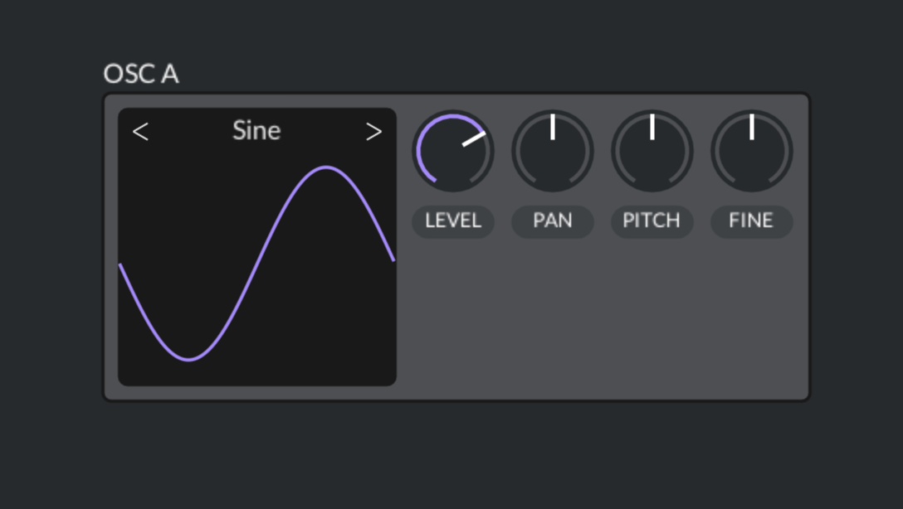
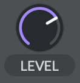

# Part 3 - Oscillators

In part 2, we implemented different types of oscillators,
and we even had a primitive UI that allowed cycling through
the oscillators and pitch-bending the frequency using mouse
click-and-drag.

In part 3, we will introduce a better UI framework that will allow us
to create knobs, buttons, selectors, sliders, and more. Having a good
UI will make the synth more fun and interactive.

By the end of this part, we'll have an interactive UI that looks like this:



## Planning

Before diving in and writing UI code, we need to plan what we want our
synth to look like.

For this part, we'll keep the UI simple and see where it takes us.
We'll need to build a UI that has the following:

* The ability to write text to an arbitrary location in the window
* The ability to draw primitive shapes, such as rectangles, lines, and cicles
* A knob, for adjusting the volume level of the oscillator
* A knob to control the left/right pan
* A knob to control coarse-grained pitch (by semitones)
* A knob to control fine-grained pitch (less than one semitone)
* A waveform plot with a waveform selector on top. Something like the
  selector in Vital synth


I did a fair bit of research on immediate mode GUIs vs retained mode GUIs.
Casey Muratori has an excellent [video](https://www.youtube.com/watch?v=Z1qyvQsjK5Y&ab_channel=CaseyMuratori)
explaining the difference between the two if this is the first time you've
heard those terms.

After some back and forth, I decided to use an immediate mode GUI
(or IMGUI, for short), for a couple of reasons:

* IMGUI is good for fast development and easier to get started.
* It's a fun experiment in IMGUI. At least, more fun than using Qt (or any other retained mode GUI).

At this point, you might (rightly) be asking questions like:

* Why are you designing your own UI library?
* Why not just use Dear ImGui?
* Why not just use the JUCE framework, which includes UI elements?

To this, I would say: because it seems interesting to me to design a UI from
scratch, without relying on third-party libraries. Also, we can easily build
exactly what we need, and it will be custom-tailored for this synth. We're
not building a general-purpose UI library, we're creating a UI specifically
for this synth project.

I'm completely new to designing UI frameworks, so this could be a complete
disaster. Let's go!

_(Edit from the future: I'm done with code for this part, and the UI took me a
lot longer than expected! But it was a fun journey and I learned a lot,
so no regrets)._

## Refactor - Moving code out of main.cpp

Currently, all of our code is in `main.cpp`. However, things are getting a bit
messy there, so in preparation for our UI work, we'll introduce new files to
add structure to our project.

| File | Description |
| --- | --- |
| `synth.h` | A struct containing all of the data for the entire synth application. |
* `sdlwrapper.h/.cpp` | All of the boiler-plate SDL code to create a window initialize audio.
  This is basically just an SDL wrapper
  library that is agnostic of our application code. We call into the library,
  but the library doesn't call into us. |
| `input.h/.cpp` | Polls for input and keyboard events each frame, and tracks
  state for various events ("mouseWentUp on this frame", "the A key was
  pressed this frame"). The UI code will use this library to know when certain
  input events happen. |
| `audio.h/audio.cpp` | Contains the SDL audio callback functions. Most of the
    audio processing code will happen in other modules, so this callback
    uses those modules to get the latest audio samples. |
| `oscillator.h/.cpp` | Contains the code that generates the
    oscillator sound sources based on various parameters that the UI controls.  |
| `utility.h/.cpp` | General-purpose utility functions used throughout. |
| `ui.h/.cpp` | The user interface. Interacts closely with `input` and `oscillator`. |
| `main.cpp` | Much smaller now, contains just the main loop and not much else.  |

This new structure will give us a better base to build upon for this a future
parts.

## Libraries to help design a UI

When I started this part, I thought I'd be able to draw the entire UI using
only the 2D accelerated graphics provided by SDL2. They give you functions
to draw pixels, lines, and rectangles, and from there, you can in theory
create any kind of UI you want. Or so I thought.

In reality, there's a lot more to it. Drawing shapes like filled circles and
rounded rectangles is not exactly easy. In my attempt to do this, I made some
progress, but the end result looked terrible, mostly due to aliasing, or
"jaggies". It didn't look smooth and clean, and there was a visible and
disgusting stairstep pattern on all circles and lines. As I began to research
anti-aliasing algorithms, it became clear that I was not having fun, and
I should just find a library that can help me draw nice, clean, anti-aliased
shapes, and has a nice API.

In the end, I decided to go with [NanoVG](https://github.com/memononen/nanovg), a vector-drawing library in C. This
library is based around OpenGL. So there's an extra bit of work to render
using OpenGL and start drawing with nanovg. There's a nice example
[gist](https://gist.github.com/xeekworx/4c9a95c5eb67a1d3fc1fd35bacf84236)
that explains how to setup SDL + GLAD + OpenGL + NanoVG in C++.

So it makes sense at this point
to completely scrap the old UI and render code, and to start from scratch
(which is not a huge loss, since we didn't have much of a UI to begin with).

The new libraries have been imported into the `third_party` directory at the
root of the repo, and the new OpenGL setup code can be found in
`sdlwrapper.cpp`.

## Label Widget

One of the most basic parts of any UI is text, so we'll need to have
a label widget in our UI.

The NanoVG library we imported has pretty good support for rendering text,
so we just need to pick a font and initialize it:

```cpp
// ...
static const char* DEFAULT_FONT = "../assets/fonts/Lato-Regular.ttf";
// ...
bool UI::Init(Synth* synth) {
    // ...
    int flags = NVG_STENCIL_STROKES | NVG_ANTIALIAS;
    _nvg = nvgCreateGL3(flags);
    _fontId = nvgCreateFont(_nvg, "default", DEFAULT_FONT);
    nvgFontFaceId(_nvg, _fontId);
    // ...
}
```

Now we have everything we need to draw a label at an absolute x/y pixel
location:

```cpp
// Align text horiz center at x, text vert top at y
void UI::Label(
        const char* text,
        float x, float y,
        float fontsize,
        NVGcolor color,
        int alignFlags) {
    nvgBeginPath(_nvg);
    nvgTextAlign(_nvg, alignFlags);
    nvgFillColor(_nvg, color);
    nvgText(_nvg, x, y, text, NULL);
}
```

The `alignFlags` parameter is a way to tell NanoVG how to interpret the
`x` and `y` parameters. The default flags are set to:

```
NVG_ALIGN_MIDDLE | NVG_ALIGN_CENTER | NVG_ALIGN_MIDDLE
```

which tells NanoVG that (x, y) is the mid-point of the text, both vertically
and horizontally. You can use other flags to left-align, top-align, etc.

## Interactivity via IMGUI

The label widget is great, but it's kind of boring. The user doesn't interact
with it, so it's just kind of drawn to the screen each frame, and that's it.

The rest of our widgets are going to require interactivity, so I wanted to
explain the basic principles of how that is going to work.

Overall, when `UI::Draw` gets called each frame, we will draw the entire UI,
and each element will determine how to draw itself based on whether it is
"preactive", or "active", or neither:

* Active: The widget is currently be interacted with by the user (e.g. user
  clicked on the widget).
* Preactive: The widget is about to be interacted with (e.g. user is hovering
 their mouse over the widget, but has not yet clicked it).

The definition of what it means to be "active" or "preactive" will be the
responsibility of each widget. For instance, a button widget would be
preactive when the mouse is hovering over the button, then becomes active on
a mouse down event, and stays active until they lift the mouse button, or they
move the mouse outside of the button. The widget can then customize the way
it's drawn, based on whether it is preactive or active (or neither), making
the widget flexible and responsive to user input.

At the `UI` level, there can be at most one preactive and active widget. So
if a widget determines it's active, it will set itself as the active widget. In
that sense, widgets can "steal" ownership of preactive/active from other widgets.

In general, widgets should not need any widget-specific state. This keeps the
widget simple and pure, which is in stark contrast to retained mode GUIs where the
widget state has to be maintained via calls to `set_visible`, `set_opacity`,
etc, which changes state variables internal to the widget. In our UI, we simply draw
the widgets from scratch each frame - they literally don't exist until we draw
them for that frame. So there's no frame-to-frame state to keep track of,
other than which widget is active and which is preactive (which is state
maintained outside of the widgets).

This approach to UI, where each widget is drawn every frame, and the state
inside the widget is minimized, is called Immediate Mode GUI (or IMGUI).

### IMGUI Widget IDs

For keeping track of which widget is active and preactive, we identify widgets using
a "widget ID" - a `size_t` that uniquely identifies a specific widget
instance.

```cpp
    size_t _preactiveId = 0; // ID of widget about to be active (e.g. hovering)
    size_t _activeId = 0; // ID of widget that is active, being interacted with (e.g. mouse click)
```

These unique IDs help differentiate, e.g. one knob widget from another.

We have a UI hierarchy that currently looks something like this:

```
UI
    Oscillator
        WaveformSelector
            ArrowButton (left)
                Arrow
                Button
            ArrowButton (right)
            Label
            WaveformVisualizer
        Knob (level)
        Knob (pan)
        Knob (coarse pitch)
        Knob (fine pitch)
```

Widget IDs are generated by hashing unique identifying information about
widget instances (e.g. knob label is "PAN") combined with the hash of its
ancestral widgets in the UI hierarchy. There is the concept of an "ID stack",
which is simply a vector of IDs that is updated as we traverse the UI
hierarchy each frame.

To generate an ID, each widget uses the `ScopedId` RAII class. Widgets use
this to get their ID, to determine if they are active or preactive:

```cpp
void UI::Knob(const char* text, float x, float y, float zero, float defaultLev, float* level, const char* valuetext) {
    size_t id = ScopedId(_idStack, text).value();
    // ...
```

The `ScopedId` constructor generates the ID by combining the ID from
the top the stack (which captures the context of the widget in the UI
hierarchy), along with arbitrary data, and then pushes the ID onto the stack.
When the object goes out of scope, the ID is automatically popped off the ID stack.

```cpp
// Helper class, make it easy to generate and push a new ID on the ID stack
// in the current scope and automatically pop when leaving scope.
template <typename T>
class ScopedId {
public:
    ScopedId(std::vector<size_t>& idStack, const T& data) : _idStack(idStack) {
        size_t seed = idStack.back();
        size_t id = HashCombine(seed, std::hash<T>{}(data));
        _idStack.push_back(id);
    }
    ~ScopedId() {
        _idStack.pop_back();
    }
    size_t value() const {
        return _idStack.back();
    }
private:
    std::vector<size_t>& _idStack;
};
```

## Knob Widget

Every synthesizer out there has some kind of knob. This is going to be
a key piece of UI for us.

We're basically going to try to recreate the knob design from the Vital synth:



I won't go into detail about how to draw the knob. It's not particularly
interesting code. Just some calls to NanoVG functions to draw circles and
lines.

The knob detects whether it is active/preactive/neither with the following
code:

```cpp
    bool mouseInside = MouseInRect(x, y, x+KNOB_WIDTH, y+KNOB_HEIGHT);
    bool resetToDefault = IsActive(id) && _input->mouseDoubleClick;
    if (!IsActive(id) && !IsPreactive(id)) {
        if (mouseInside && !ActiveExists()) {
            _preactiveId = id;
        }
    }
    if (!IsActive(id) && IsPreactive(id)) {
        if (!mouseInside) {
            _preactiveId = 0;
        } else if (_input->mouseWentDown) {
            _activeId = id;
        }
    }
    if (IsActive(id)) {
        assert(IsPreactive(id));
        if (_input->mouseWentUp) {
            _activeId = 0;
        }
    }
```

It's basically a little state machine:

* Idle -> Preactive: when mouse cursor is inside the knob and there's not another active widget
* Preactive -> Idle: When the mouse cursor moves away
* Preactive -> Active: When the mouse button is pressed down
* Active -> Preactive: When the mouse button comes back up

The widget remains active while the mouse button is down, and the mouse cursor
can move outside the widget while remaining active. The user controls the knob
level by clicking and dragging vertically.

The knob widget itself doesn't know what the level value actually means - that
is the responsibility of higher level code.

### Drawing the Knob

There are actually several different fundamental shapes we'll need to draw:

* A filled circle (already done by `drawCircle`)
* A thick arc, from about 7 o'clock to 5 o' clock, for the knob's range of position
* A short thick line, for the visual indicator of the knob's position
* A rounded rectangle with text in it, for the knob label

First, we'll rename `drawCircle` to `drawFilledCircle`, since we'll soon be
drawing non-filled circles.

Next, let's try to draw an arc. This is kind of like drawing a partial
non-filled circle. Also, we need to be able to specify the thickness in
pixels.

```cpp
void UI::drawArc(
        int centerX,
        int centerY,
        int radius,
        int strokeWidth,
        double startAngleRad,
        double endAngleRad) {
    SDL_SetRenderDrawColor(_renderer, 50, 205, 50, 255); // lime green
    for (double angle = startAngleRad; angle < endAngleRad; angle += (M_PI / 360.0)) {
        int px = (int)((double)radius * cos(angle));
        int py = -1 * (int)((double)radius * sin(angle));
        drawFilledCircle(centerX + px, centerY + py, strokeWidth);
    }
}
```

## ArrowButton Widget

## Oscillator Widget

## Keyboard controlled note input

## Volume level control

## Pitch control, coarse and fine

## Stereo panning control

(linear vs constant power panning)

```cpp
// Linear panning
float leftWeight = utility::Map(pan, -.5f, .5f, 1.f, 0.f);
float rightWeight = 1.f - leftWeight;
*left *= leftWeight;
*right *= rightWeight;
```

```cpp
// Constant power panning
float theta = utility::Map(pan, -.5f, .5f, 0.f, (float)M_PI / 2.f);
*left *= cos(theta);
*right *= sin(theta);
```

